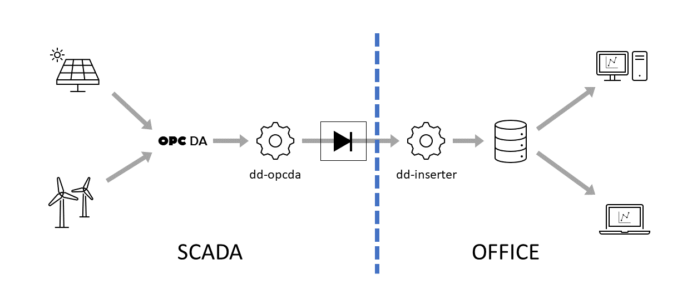

# dd-inserter - Simple process data TimescaleDB inserter
**cyops-se**: *This application is part of the cyops.se community and use the same language and terminology. If there are acronyms or descriptions here that are unknown or ambiguous, please visit the [documentations](https://github.com/cyops-se/docs) site to see if it is explained there. You are welcome to help us improve the content regardless if you find what you are looking for or not*.

## Introduction
This application (```dd-inserter```) receives one way UDP messages produced by [dd-opcda](https://github.com/cyops-se/dd-opcda) and inserts the data into a timescale database.
Typical usage is as the outer end of a data diode used to replicate real time data from a sensitive system to a potentially hostile network in order to maintain full network isolation of the sensitive network.



## Overview
```dd-inserter``` listens by default at UDP port 4357 (configurable) for messages sent by ```dd-opcda``` through a data diode. The messages are interpreted and stored in a specified Timescale database (localhost by default).

***This is a very basic solution with a lot of opportunities for improvements like reliable streaming, forward error correction, reliable notifications of data loss, operator friendly initiation of re-transmission, etc***

## Sequence checks
To detect data loss, a simple sequence number is sent with every message. Data loss is reported as soon as the sequence is broken which is not fully reliable as UDP packets are not guaranteed to come in the order they were sent.

# Build
The application has been successfully been tested on Windows (x86_64) and Linux (x86_64) but should work on any platform that is supported by the third party postgres drivers used by this application.

Run the following commands to build a ```dd-inserter``` executable (Windows)

```
> go get github.com/cyops-se/dd-inserter
> cd %GOPATH%\src\github.com\cyops-se\dd-inserter
> go build
```

# Installation
```dd-inserter``` is dependent on a local Timescale timeseries database with specific table structures. Instructions on how to install the Timescale timeseries database for use with ```dd-inserter``` (and Grafana) can be found [here!](./TIMESCALE.md)

## Set up a timescale database for use with ```dd-inserter```

The application is currently hardcoded to use a specific hyper table and structure according to the following PostgreSQL commands as shown below.

***You must now use the password entered during the installation of the PostgreSQL database engine***

```
> psql -U postgres
Password for user postgres: XXXX
```
```
psql# CREATE DATABASE processdata;
psql# \c processdata
psql# CREATE EXTENSION IF NOT EXISTS timescaledb;
psql# CREATE TABLE measurements (time TIMESTAMPTZ NOT NULL, name TEXT NOT NULL, value DOUBLE PRECISION NOT NULL, quality NUMERIC NOT NULL);
psql# SELECT create_hypertable('measurements','time');
```

If you get an error when creating the extension, it is probably because you didn't restart the PostgreSQL windows service after installing TimescaleDB. See [this instruction](./TIMESCALE.md) for more information.


